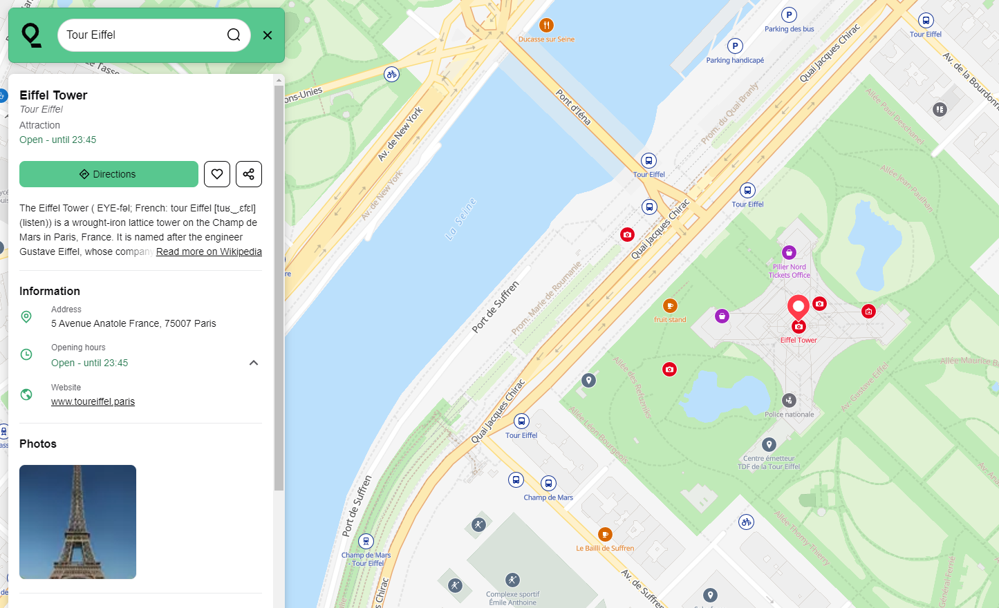

<h1 align="center">
  
</h1>

<h5 align="center">
  <a href="https://www.qwant.com/maps">Maps</a> |
  <a href="./contributing.md">Contribute</a> |
  <a href="https://betterweb.qwant.com/en/qwant-maps-a-open-and-privacy-focused-map/">About</a> |
  <a href="https://github.com/Qwant/erdapfel">Frontend</a> |
  <a href="https://github.com/Qwant/kartotherian_docker">Tile server</a> |
  <a href="https://github.com/CanalTP/mimirsbrunn">Geocoder</a> |
  <a href="https://github.com/Qwant/idunn">Internal API</a>
</h5>

🗺️ <a href="https://www.qwant.com/maps"><strong>Qwant Maps</strong></a> is a map application that respects your privacy 🔍

## Qwant Maps URLs

Qwant Maps provides links you can share with your friends to help them to #SwitchToQwant and #SwitchToOSM.
For instance you can:
- search for a specific location on the map with the following format:  
`https://www.qwant.com/maps/#map=<zoom level>/<latitude>/<longitude>`  
Example: https://www.qwant.com/maps/#map=12.08/48.8642287/2.3391427

- search a specific place on the map with the following path:  
`https://www.qwant.com/maps/place/<id>`  
Example: https://www.qwant.com/maps/place/osm:node:532031656@LExpress_de_Lyon

#### A routing request

This endpoint points to a routing form and can pre-fill some of the fields.  
For instance: https://www.qwant.com/maps/routes/?origin=latlon:48.8459543:2.3714015&destination=latlon:48.8702200:2.27863300&mode[]=walking#map=18.00/48.8459543/2.3714015

The parameters corresponding to this endpoint are the following:

| Name | Required| Description |
| -------- | :--------: | -------- |
| origin    |   :x:   | `id` of some place to use as the starting point     |
| destination    |   :x:   | `id` of some place to use as the ending point  |
| mode   |   :x:   | if you want to pre-select a routing mode in the routing form. One of `walking`, `cycling`, `driving`, `public_transport`

## Architecture

Qwant Maps can be seen as 4 separated components:

* a tile server,
* a search engine (geocoder),
* an API to detail points of interest and places,
* a front end.

#### Tile server

A tile server is a service whose job is to give all that is needed to display a fraction of a map.

Qwant Maps provides only [vector tiles](https://en.wikipedia.org/wiki/Vector_tiles) so the tile server does not serve images (as it is done with [raster tiles](https://switch2osm.org/the-basics/)) but raw data. It is the front end, [Erdapfel](#erdapfel), that takes the data and renders it into a user browsable map.

The tile server is a combination of 2 great opensource projects:

* [kartotherian](https://github.com/kartotherian/kartotherian), the Wikimedia stack to have a highly available tile server. It is itself based on a number of [mapbox](https://www.mapbox.com/) components,
* [OpenMapTiles](https://github.com/openmaptiles/openmaptiles), for their great and flexible tile schema.

OpenMapTiles makes it possible for Qwant Maps to have an [easy to define/extend](https://github.com/Qwant/openmaptiles) vector tile schema.

All the data (see [below](#tilesdata)) are imported in a [PostgreSQL](https://www.postgresql.org/) database using mainly [imposm](https://imposm.org/docs/imposm3/latest/). All the world's vector tiles are then generated using kartotherian's [tilerator](https://github.com/kartotherian/tilerator) and stored in [Cassandra](http://cassandra.apache.org/). This enables Qwant Maps to have a fast and scalable way to serve tiles.

#### Geocoder

The geographical search engine (also called geocoder) used for Qwant Maps is [Mimirsbrunn](https://github.com/CanalTP/mimirsbrunn).

Mimirsbrunn is a geocoder based on [Elasticsearch](https://www.elastic.co) and rust components developed by [Kisio Digital](http://www.kisiodigital.com/).

#### Places API

To get more details on places and Points Of Interest (POIs), Qwant Maps uses an additional API: [Idunn](https://github.com/Qwant/idunn), that combines the information in the geocoder with external APIs to format detailed POIs data to display in the front end.

#### Front end 

Qwant Maps's front, [Erdapfel](https://github.com/Qwant/erdapfel), is a Javascript single page app that allows to browse the map, search for places, see your position on the map, etc.

The front end uses [Mapbox GL](https://www.mapbox.com/mapbox-gl-js/api/) to render the map, using both the tiles from the tile server, and Qwant Maps [custom map style](https://github.com/Qwant/qwant-basic-gl-style).

## Data

#### Tiles data 

The main source of data for the tile server is the awesome [OpenStreetMap](https://www.openstreetmap.org) (OSM) data :heart: but other data like [natural earth](http://www.naturalearthdata.com/), better water polygon... are also used.

All the tile's data import process is defined in [python scripts](https://github.com/Qwant/kartotherian_docker/tree/master/import_data).

This tool imports all the data into the PostgreSQL database and runs lots of post-process SQL functions (those functions are defined as postgresql triggers), so they will also be able to run on the [OSM updates](#osm_updates).

When the data is loaded in PostgreSQL, we use [tilerator](https://github.com/kartotherian/tilerator) to generate all the tiles from the zoom level 0 to 14 and store them in Cassandra.
This way, when a vector tile is requested to the tiles API [kartotherian](https://github.com/kartotherian/kartotherian), no computation needs to be done, only a simple query by id on the highly available Cassandra to get the raw protobuf tiles stored in it.

#### Geocoder data <a name="geocoder_data"><a/>

The data import process in [Mimirsbrunn](https://github.com/CanalTP/mimirsbrunn) is defined in a [python script](https://github.com/Qwant/docker_mimir/blob/master/tasks.py).

First, the OSM data is given to [Cosmogony](https://github.com/osm-without-borders/cosmogony) which outputs a big JSON file with all the world's administrative regions.

This file is then imported in Mimir by [cosmogony2mimir](https://github.com/CanalTP/mimirsbrunn#cosmogony2mimir).

We then import addresses using [addresses-importer](https://github.com/Qwant/addresses-importer). It downloads datasets of addresses (from [OpenAddresses](http://openaddresses.io/) and [OpenStreetMap](https://www.openstreetmap.org) mostly), deduplicate them and then import them into our geocoder using [openaddresses2mimir](https://github.com/CanalTP/mimirsbrunn#openaddresses2mimir).

The streets are imported afterwards from the OSM pbf file with [osm2mimir](https://github.com/CanalTP/mimirsbrunn#osm2mimir).

Finally the POIs are extracted from the PostgreSQL database (thus we have a unified POI handling) using [Fafnir](https://github.com/Qwant/fafnir).

#### Places API data

Idunn does not need its own data import process, but the API depends on:

* the data of the [geocoder](#geocoder_data),
* Wikipedia data, fetched either on the Wikipedia APIs or in a custom Elasticsearch database.

##### OSM updates 

The world keeps moving and OpenStreetMap data is getting better and better every day, so we need to update the data in all our components on a regular basis.
The import of the world's data is quite a long process, so after the initial import, a dedicated [task](https://github.com/Qwant/kartotherian_docker/blob/master/import_data/tasks/osm_update.py) is used to read the OSM differential updates and apply the changes in the PostgreSQL database on a daily basis.

Once we have up-to-date data in PostgreSQL, we can import again the geocoder POIs data and regenerate the tiles impacted by the changes.

We update the remaining geocoder data (administrative regions, streets and addresses) on a monthly basis.

## Global picture

NB: To provide the Qwant Maps service, Qwant hosts instances of the tile server, the geocoder and the Idunn API on its own servers.

Please note that Qwant instances are internal components and are not meant (yet) to be used directly other than as part of Qwant Maps. You can learn more in our [Terms of services](https://about.qwant.com/fr/legal/cgu/qwant-maps/)

## How to run

#### Tiles

To run the tileserver, the easiest way is to use Docker.

The project [kartotherian_docker](https://github.com/Qwant/kartotherian_docker) provides a docker-compose with all that is needed.

This repository notably includes glue code to initiate and maintain Qwant Maps tiles:

* imposm mappings/openmaptiles configurations (generated from [Qwant's openmaptiles fork](https://github.com/Qwant/openmaptiles#openmaptiles-fork-for-qwant-maps) with the [openmaptiles-tools](https://github.com/openmaptiles/openmaptiles-tools)).
* data import pipeline scripts
* update scripts
* kartotherian/tilerator generic configurations

#### Geocoder

The repository [docker_mimir](https://github.com/Qwant/docker_mimir) contains a docker-compose to easily spawn the needed Docker containers and to import the needed data in them.

#### Places API

[Idunn](https://github.com/Qwant/idunn) is a custom Python API for Qwant Maps places and features (based on [FastAPI](https://fastapi.tiangolo.com/)).

The [readme](https://github.com/Qwant/idunn#running) details the way to run it.

#### Front end

Erdapfel is a simple node application but you can also use Docker to run it.

You will need to set a few environment variables to link it to the other Qwant Maps components. Check out the [readme](https://github.com/Qwant/erdapfel) to know more about its configuration.
